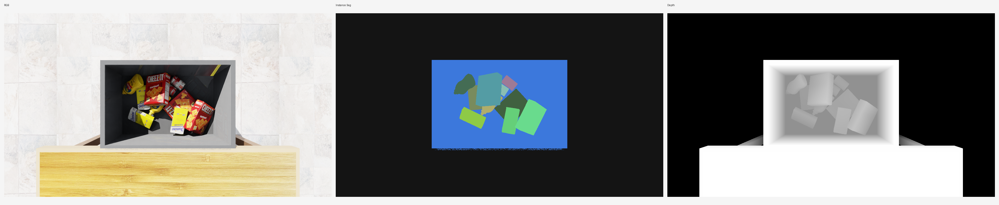
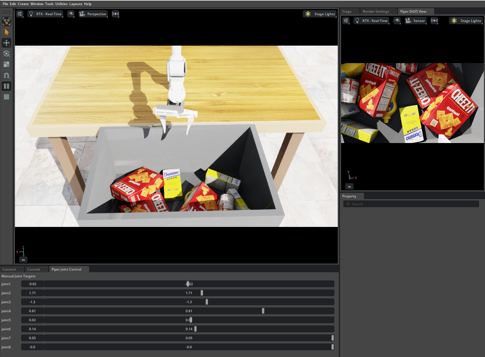
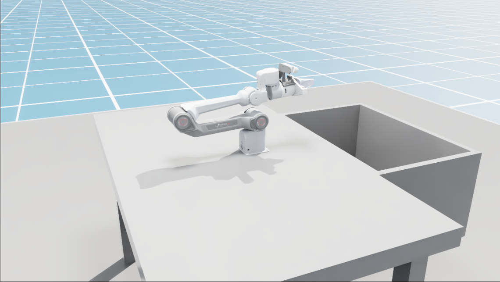

# isaac_table

Simple Isaac Sim tabletop bin-picking scene with an overhead RGB-D camera.





## Handoff

Tested setup:

- Isaac Sim `5.1.x`
- Windows

External prerequisites expected by the current scripts:

- Isaac asset root:
  - `C:\Users\Warra\Downloads\Assets\Isaac\5.1`
- AgileX Piper repo cloned into the Isaac install root:
  - `C:\Users\Warra\Downloads\Isaac\piper_isaac_sim`

Known-good current state:

- `simple_floor_table.py` builds the table/bin scene and overhead RealSense-style RGB-D camera.
- RGB, depth, and custom instance segmentation capture are working.
- YCB object dropping works from the local Isaac `Materials & Props` asset pack.
- `piper/bin_pick/piper_x_scene.py` loads one Piper X onto the table from the shipped AgileX USD.
- `piper/simple_pick/piper_x_simple_pick_ps5.py` provides PS5 teleop for the simple pick/place POC.

Known caveats:

- The YCB setup is not self-contained in this repo; it depends on the local Isaac asset pack.
- The Piper setup is not self-contained in this repo; it depends on the separately cloned `piper_isaac_sim` repo.
- On Windows, the cloned Piper repo has mesh filename case collisions such as `base_Link.dae` vs `base_link.dae`.
- For that reason, the current robot scene uses the shipped `piper_x_v1.usd` instead of re-importing the URDF.
- The current Piper motion test uses direct joint state setting, so it teleports between poses instead of moving under a smooth controller.
- Only one Piper arm is integrated so far. Dual-arm is still pending.

Recommended next steps:

1. Replace the Piper teleport test with articulation-controller-based joint target control.
2. Tune one-arm base placement and reachable pre-grasp poses into the side bin.
3. Verify end-effector frame orientation and gripper behavior.
4. Duplicate and mirror the setup into a dual-arm table scene.

## Layout

- `simple_floor_table.py`: tabletop bin scene with clutter drop and top-down RGB-D capture.
- `debug/`: controller and robot-debug scripts.
- `piper/bin_pick/`: Piper tabletop bin-pick scenes and teleop utilities.
- `piper/simple_pick/`: simpler red-to-blue pick/place POC scenes.

## Run

From the Isaac Sim install root:

```powershell
.\python.bat standalone_examples\user\isaac_table\simple_floor_table.py
```

Useful options:

```powershell
.\python.bat standalone_examples\user\isaac_table\simple_floor_table.py --num-objects 8 --seed 7
.\python.bat standalone_examples\user\isaac_table\simple_floor_table.py --object-source prims
.\\python.bat standalone_examples\user\isaac_table\simple_floor_table.py --object-source ycb --asset-root "C:/Users/Warra/Downloads/Assets/Isaac/5.1"
```

Captured outputs are written to `camera_debug/` after the dropped objects settle. Example captured renders are also copied into `media/`.

## Piper X Setup

<p align="center">
  
</p>

Clone the AgileX Isaac Sim repo into the Isaac root:

```powershell
git clone https://github.com/agilexrobotics/piper_isaac_sim.git
```

This scene currently uses the following USD from that repo:

```text
C:\Users\Warra\Downloads\Isaac\piper_isaac_sim\USD\piper_x_v1.usd
```

Run the single-arm Piper scene:

```powershell
.\python.bat standalone_examples\user\isaac_table\piper\bin_pick\piper_x_scene.py
```

Run the unified Piper scene with clutter and the top-down camera:

```powershell
.\python.bat standalone_examples\user\isaac_table\piper\bin_pick\piper_x_scene.py --object-source ycb --robot-camera-view --joint-ui --topdown-camera
```

Run the simple pick/place PS5 teleop scene:

```powershell
.\python.bat standalone_examples\user\isaac_table\piper\simple_pick\piper_x_simple_pick_ps5.py
```

Useful Piper options:

```powershell
.\python.bat standalone_examples\user\isaac_table\piper\bin_pick\piper_x_scene.py --robot-y 0.18
.\python.bat standalone_examples\user\isaac_table\piper\simple_pick\piper_x_simple_pick_ps5.py --translation-scale 0.0018
```

Notes:

- The scene uses the shipped `piper_x_v1.usd`, not a fresh URDF import.
- This is intentional on Windows because the cloned repo has mesh filename case collisions such as `base_Link.dae` vs `base_link.dae`.
- Lula is configured arm-only for IK. Gripper control is handled separately.

## Robot Debug

Useful Piper/Lula debug scripts:

```powershell
.\python.bat standalone_examples\user\isaac_table\debug\piper_x_joint_debug.py
.\python.bat standalone_examples\user\isaac_table\piper\bin_pick\piper_x_scene.py --ik-ui
.\python.bat standalone_examples\user\isaac_table\piper\bin_pick\piper_x_square_loop.py
.\python.bat standalone_examples\user\isaac_table\piper\bin_pick\piper_x_circle_loop.py
.\python.bat standalone_examples\user\isaac_table\debug\ps5_debug.py
.\python.bat standalone_examples\user\isaac_table\debug\ps5_scene_debug.py
```

Notes:

- `debug/piper_x_joint_debug.py` is the frame-debugger: joint sliders, colored link markers, and live link positions.
- `piper/bin_pick/piper_x_scene.py --ik-ui` is the interactive world-space IK target tool with rotation sliders.
- `piper/bin_pick/piper_x_square_loop.py` uses the canonical task-space pose and traces a clockwise square in XY.
- `piper/bin_pick/piper_x_circle_loop.py` uses the same canonical pose and streams dense circle targets for a smoother loop.
- `debug/ps5_debug.py` is the raw PS5 input probe.
- `debug/ps5_scene_debug.py` maps PS5 input onto a simple scene marker before touching the robot.

## YCB Assets

The script supports a local Isaac asset pack and expects the asset root to be the folder containing the top-level `Isaac` directory.

Expected local asset root:

```text
C:\Users\Warra\Downloads\Assets\Isaac\5.1
```

Expected YCB path under that root:

```text
C:\Users\Warra\Downloads\Assets\Isaac\5.1\Isaac\Props\YCB\Axis_Aligned_Physics
```

Get the assets from the official Isaac Sim 5.1.0 download page:

- https://docs.isaacsim.omniverse.nvidia.com/5.1.0/installation/download.html

For YCB, the relevant archive is the `Materials & Props` asset pack.

## Notes

- `prims` works without any external assets.
- `ycb` uses local USD assets from the Isaac asset pack and drops them into the bin from above.
- The overhead camera is configured as a RealSense-style RGB-D camera centered over the side-mounted bin.
- The script saves one RGB/depth capture after the clutter settles, or after a timeout if the objects keep jittering.
